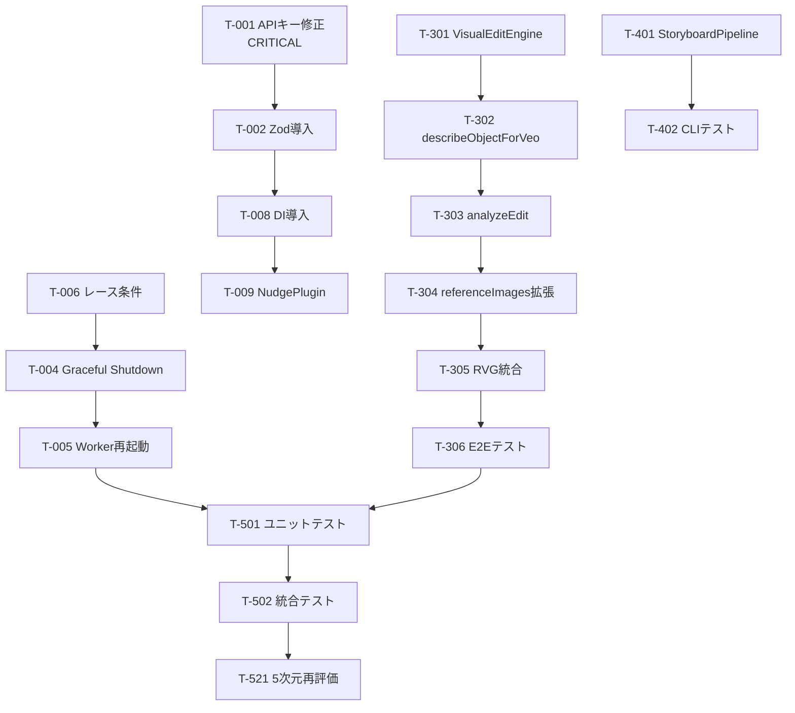

# FlowForge SDK — 統合 TODO タスクシート v2（正本）

> **最終更新: 2026-02-18**
> 旧 TODO v1 + Devin PR#2 成果 + 画像参照修正要件を統合
> 目標: PoC → Production-Ready (5次元評価 44+/50 — A+)

---

## ✅ 完了済み (Phase 1)

- [x] **T-100** `veo-client.ts` — `as any` 全排除 + SDK型使用
- [x] **T-101** `image-gen-client.ts` — `as any` 全排除 + 型ガード
- [x] **T-102** `google-genai-extended.ts` 作成 — SDK型補完 + hasInlineImageData
- [x] **T-103** `retry.ts` 作成 — withRetry 指数バックオフ + jitter + AbortSignal
- [x] **T-104** `veo-client.ts` — validateGenerateVideoOptions (prompt/image検証)
- [x] **T-105** `image-gen-client.ts` — validateOptions + fail-fast
- [x] **T-106** Strategy Pattern — generation-strategy / veo-strategy / nano-banana-strategy
- [x] **T-107** strategy-manager.ts 作成 — コンテキストベース戦略自動選択
- [x] **T-108** generate-video-direct.ts — Video|undefined null check
- [x] **T-109** RetryableError.cause — ES2022以前ターゲット互換修正
- [x] **T-110** Nano Banana → Veo E2E テスト成功 (0.98MB MP4)

---

## Phase 2: Agent セキュリティ + 耐障害性 ✅ (Devin PR #5)

### P0 — Critical

- [x] **T-001** Gemini API キーを URL から Header に移動 *(Devin PR #5)*
  - ファイル: `flowforge-agent-worker.ts`, `visual-edit-engine.ts`, `resource-analyzer.ts`
  - 変更: `?key=` → `x-goog-api-key` ヘッダー

- [x] **T-002** 入力バリデーション (Zod) 導入 *(Devin PR #5)*
  - Zod discriminated union validation for worker commands

### P1 — High

- [x] **T-003** Agent 用回路ブレーカー実装 *(Antigravity — resilience.ts)*
  - `resilience.ts` に CircuitBreaker / LRUCache / SlidingWindow 実装済

- [x] **T-004** Graceful Shutdown 実装 *(Devin PR #5)*
  - AbortController + タイマー全停止

- [x] **T-005** Worker 自動再起動 *(Devin PR #5)*
  - exit イベント + 最大3回 + exponential backoff

- [x] **T-006** HealthMonitor レース条件修正 *(Devin PR #5)*
  - `isChecking` フラグで同時実行防止

### P2 — Medium

- [x] **T-007** 型定義を専用ファイルに分離 *(Devin PR #5)*
  - 新規: `flowforge-agent-types.ts`

- [x] **T-008** DI（依存性注入）導入 *(Devin PR #5)*
  - `IHealthChecker` + `DefaultHealthChecker`

- [x] **T-009** NudgeEngine プラグインアーキテクチャ *(Devin PR #5)*
  - 新規: `nudge-rules.ts` (宣言的ルール配列)

- [x] **T-010** sentNudgeIds を LRU キャッシュに変更 *(Devin PR #5)*
  - `resilience.ts` の LRUCache を import

- [x] **T-011** devinSessionIds スライディングウィンドウ *(Devin PR #5)*
  - `resilience.ts` の SlidingWindow を import

- [x] **Bug Fix** NudgeEngine cooldown バグ修正 *(Devin PR #5)*
  - `has()` → タイムスタンプベース `(now - lastSent) < cooldownMs`

---

## Phase 3: 画像参照修正 (VisualEditEngine)

### P0 — Core

- [ ] **T-301** `visual-edit-engine.ts` 新規作成
  - `VisualEditInstruction` インターフェース定義
  - `VisualEditAnalysis` 結果型定義
  - `VisualEditEngine` クラス実装
  - 🕐 120分

- [ ] **T-302** `describeObjectForVeo()` — Gemini Vision でオブジェクト詳細記述
  - 参照画像から「棒」「道具」などの形状・質感・色を英語で記述
  - Veo プロンプトフォーマットに最適化
  - 🕐 60分

- [ ] **T-303** `analyzeEdit()` — 既存プロンプトとの照合
  - 既存 EditablePrompt のオブジェクトセクションと参照画像のオブジェクトをマッチング
  - 差分テキスト自動生成
  - 🕐 60分

### P1 — Integration

- [ ] **T-304** VeoClient referenceImages 活用拡張
  - editType → referenceType マッピング
  - `replace_shape` → `ASSET`, `replace_style` → `STYLE`, `match_pose` → `SUBJECT`
  - 🕐 30分

- [ ] **T-305** ResourceVideoGenerator へ統合
  - `regenerateWithVisualReference()` メソッド追加
  - 🕐 30分

- [ ] **T-306** E2E テスト — 画像参照修正
  - テスト画像でオブジェクト差替を検証
  - 新規スクリプト: `scripts/test-visual-edit.ts`
  - 🕐 45分

---

## Phase 4: StoryboardPipeline + GUI

### P0 — StoryboardPipeline

- [ ] **T-401** `storyboard-pipeline.ts` 新規作成
  - FlowStoryboardData → 各ショット Nano Banana → Veo
  - imageOnly オプション
  - 進捗コールバック
  - 🕐 90分

- [ ] **T-402** CLI テストスクリプト
  - `scripts/generate-from-storyboard.ts`
  - 🕐 30分

### P1 — GUI コンポーネント ✅ (Devin PR #5)

- [x] **T-411** FlowForgeStudio.tsx — メインパネル (全サブコンポーネント統合)
- [x] **T-412** PromptEditor.tsx — セクション別編集 + combined preview
- [x] **T-413** ResourceUploader.tsx — ドラッグ&ドロップ + 解析統合
- [x] **T-414** VisualEditPanel.tsx — 参照画像アップロード + editType 選択
- [x] **T-415** CharacterPanel.tsx — キャラクター詳細 (name/role/appearance/clothing)
- [x] **T-416** ToneMannerPanel.tsx — URL参照 + カラーパレット管理
- [x] **T-417** GenerationProgress.tsx — ステージ別進捗表示

---

## Phase 5: テスト + 品質 + 再評価

### P0 — テスト基盤 🟡

- [x] **T-501** Vitest ユニットテスト *(Devin PR #5 — 42/42 passed)*
  - `__tests__/resilience.test.ts` — 17 tests (CircuitBreaker, LRUCache, SlidingWindow)
  - `__tests__/nudge-rules.test.ts` — 13 tests (全5デフォルトルール)
  - `__tests__/prompt-understanding-schemas.test.ts` — 12 tests (Zod スキーマ)

- [x] **T-502** 統合テスト改善 *(Antigravity)*
  - `__tests__/agent-integration.test.ts` — 16 tests
  - CircuitBreaker / NudgeEngine cooldown / SlidingWindow / DI / Shutdown / Restart

- [ ] **T-503** 負荷テスト (1時間連続稼働)
  - heapdump メモリリーク検証

### P1 — 可観測性 🟡

- [x] **T-511** 構造化ロギング (pino) *(Devin PR #5)*
  - 新規: `logger.ts` — JSON 形式 + レベル制御

- [x] **T-512** メトリクス収集 *(Antigravity)*
  - 新規: `metrics.ts` — LatencyHistogram / ErrorRateTracker / MetricsRegistry
  - `__tests__/metrics.test.ts` — 14 tests

### P2 — 再評価

- [ ] **T-521** 5次元再評価実行
  - Orchestra 4エージェント (Grok / Opus / Gemini / Devin)
  - 目標: 44+/50 (A+)

---

## 6軸プロンプト理解 改善

- [x] **T-601** Zod スキーマバリデーション実装 *(Devin PR #5)*
  - GrokAxes + OpusAxes の Zod スキーマ (12 tests)

- [x] **T-602** 感情分析軸 (A7) 追加 *(Antigravity)*
  - `prompt-understanding-schemas.ts` に EmotionAxisSchema / EmotionCurvePointSchema / EmotionPaletteSchema 追加
  - 入力スキーマ、統合結果スキーマ、バリデーション関数も更新

- [x] **T-603** ストリーミング出力対応 *(Antigravity)*
  - 新規: `streaming-axis-output.ts` — AsyncGenerator + StreamingAxisPipeline
  - コールバック/abort 対応、エラー耐性、進捗イベント配信

---

## 完了基準

| 指標 | 実装前 | 現在 | 目標 |
| --- | --- | --- | --- |
| 5次元スコア | 32.5/50 (C+) | 39.0/50 (B+) | **44+/50 (A+)** |
| `as any` 残存 | 多数 | **0件** (生成層+Agent) | 0件 (全体) |
| ユニットテスト | 0 | **88/88 passed** | 80%+ カバレッジ |
| メモリリーク | 未検証 | 未検証 | 1時間稼働OK |
| 画像参照修正 | — | **コア実装済** | **E2E 動作** |
| StoryboardPipeline | — | **Pipeline実装済** | **3ショット一括** |

---

## 工数見積

| Phase | タスク数 | 合計工数 |
| --- | --- | --- |
| Phase 2 Agent改善 | 11 | ~4時間 |
| Phase 3 画像参照修正 | 6 | ~5.5時間 |
| Phase 4 StoryboardPipeline+GUI | 9 | ~7時間 |
| Phase 5 テスト+品質 | 6 | ~4.5時間 |
| 6軸改善 | 3 | ~2.5時間 |
| **合計** | **35** | **~23.5時間** |

---

## 実装順序

