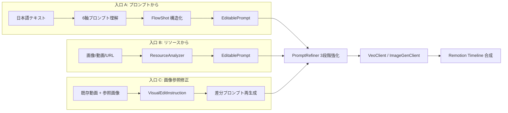
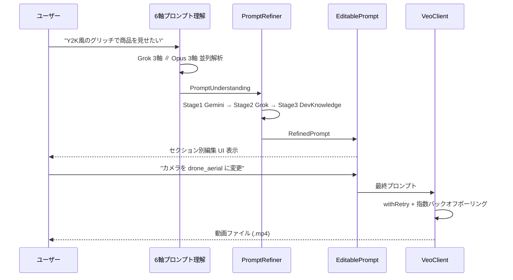
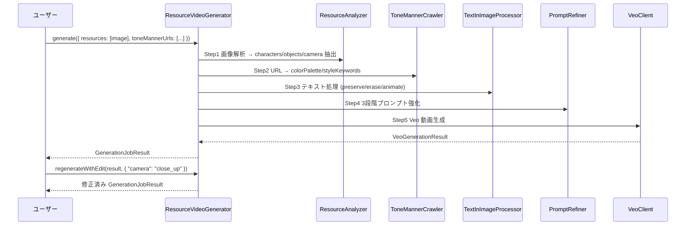
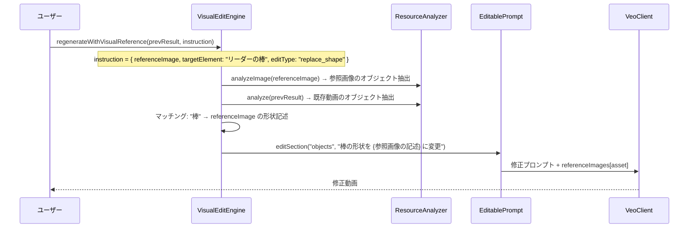
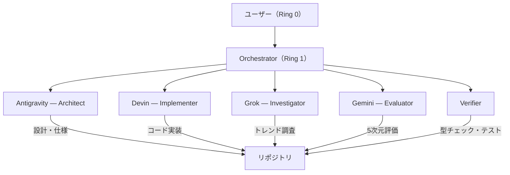

# FlowForge SDK — 統合 Runbook v2（正本）

> **最終更新: 2026-02-18**
> 旧 Runbook v1 + improvement_spec_v1 + improvement_todo + 6axis_spec + Devin PR#2 成果を統合

---

## 1. ビジョン

FlowForge は **3つの入口** から映像制作を完全制御する統合 SDK。



| 入口 | 機能 | 実装状態 |
| ------ | ------ | :--------: |
| **プロンプト → 詳細** | 誰が/何人/表情/道具/MG/トンマナ を構造化 | ✅ 実装済 |
| **リソース → 詳細** | 画像・動画を解析 → EditablePrompt に分解 → 修正 → 再生成 | ✅ 実装済 |
| **画像参照修正** | 参照画像から特定オブジェクトを抽出 → 動画の該当要素を差替 | ❌ 未実装 |

---

## 2. アーキテクチャ

### 2.1 レイヤー構成

```text
┌──────────────────────────────────────────────────────┐
│  CLI / Remotion Studio / FlowForge GUI               │  ← UI層
├──────────────────────────────────────────────────────┤
│  ResourceVideoGenerator │ StoryboardPipeline         │  ← オーケストレーション層
├──────────┬──────────┬───────────────────────────────┤
│FlowShot  │Editable  │TextInImage    │StrategyManager│  ← データモデル層
│Builder   │Prompt    │Processor      │               │
│          │          │PromptRefiner  │               │
├──────────┴──────────┴───────────────┴───────────────┤
│ ResourceAnalyzer │ ToneMannerCrawler │ 6軸理解       │  ← 解析層
├───────────────────┼─────────────────┼───────────────┤
│ VeoClient         │ ImageGenClient  │ withRetry     │  ← 生成層
├───────────────────┼─────────────────┼───────────────┤
│ GrokIntelClient   │ DevKnowledge    │ PromptUnder   │  ← インテリジェンス層
├───────────────────┼─────────────────┼───────────────┤
│ DevinClient       │ DevinTaskRunner │ DevinPlaybook │  ← 自律実行層
└───────────────────┴─────────────────┴───────────────┘
```

### 2.2 ファイル構成と実装状態

#### 生成層 (AI Media)

| ファイル | 実装 | Devin改善 | 説明 |
| ---------- | :----: | :---------: | ------ |
| [veo-client.ts](file:///c:/Users/raiko/OneDrive/Desktop/RemotionProject/src/lib/veo-client.ts) | ✅ | ✅ | Veo 3.1 動画生成 — as any 撲滅、retry、validation、AbortSignal |
| [image-gen-client.ts](file:///c:/Users/raiko/OneDrive/Desktop/RemotionProject/src/lib/image-gen-client.ts) | ✅ | ✅ | Imagen 3 / Nano Banana 画像生成 — 型ガード、retry |
| [types/google-genai-extended.ts](file:///c:/Users/raiko/OneDrive/Desktop/RemotionProject/src/lib/types/google-genai-extended.ts) | ✅ | 🆕 | SDK型補完 + hasInlineImageData 型ガード |
| [utils/retry.ts](file:///c:/Users/raiko/OneDrive/Desktop/RemotionProject/src/lib/utils/retry.ts) | ✅ | 🆕 | withRetry 指数バックオフ + AbortSignal |
| [ai-media-pipeline.ts](file:///c:/Users/raiko/OneDrive/Desktop/RemotionProject/src/lib/ai-media-pipeline.ts) | ✅ | — | AI メディアパイプライン統合 |

#### Strategy Pattern (Devin PR#2 成果)

| ファイル | 実装 | 説明 |
| ---------- | :----: | ------ |
| [strategies/generation-strategy.ts](file:///c:/Users/raiko/OneDrive/Desktop/RemotionProject/src/lib/strategies/generation-strategy.ts) | 🆕 | 抽象基底クラス (execute, canHandle, validateContext) |
| [strategies/veo-strategy.ts](file:///c:/Users/raiko/OneDrive/Desktop/RemotionProject/src/lib/strategies/veo-strategy.ts) | 🆕 | Veo 戦略 (text/text+image → video) |
| [strategies/nano-banana-strategy.ts](file:///c:/Users/raiko/OneDrive/Desktop/RemotionProject/src/lib/strategies/nano-banana-strategy.ts) | 🆕 | NanoBanana 戦略 (text → image) |
| [strategy-manager.ts](file:///c:/Users/raiko/OneDrive/Desktop/RemotionProject/src/lib/strategy-manager.ts) | 🆕 | 戦略自動選択 + 実行マネージャー |

#### データモデル層

| ファイル | 実装 | 説明 |
| ---------- | :----: | ------ |
| [flow-prompt-builder.ts](file:///c:/Users/raiko/OneDrive/Desktop/RemotionProject/src/lib/flow-prompt-builder.ts) | ✅ | FlowShot/Storyboard型 + プロンプト最適化 (625行) |
| [editable-prompt.ts](file:///c:/Users/raiko/OneDrive/Desktop/RemotionProject/src/lib/editable-prompt.ts) | ✅ | セクション別編集 + combine() + toData() |
| [prompt-refiner.ts](file:///c:/Users/raiko/OneDrive/Desktop/RemotionProject/src/lib/prompt-refiner.ts) | ✅ | 3段階強化 (Gemini→Grok→DevKnowledge) |
| [text-in-image-processor.ts](file:///c:/Users/raiko/OneDrive/Desktop/RemotionProject/src/lib/text-in-image-processor.ts) | ✅ | OCR 3モード (preserve/erase/animate) |

#### 解析層

| ファイル | 実装 | 説明 |
| ---------- | :----: | ------ |
| [resource-analyzer.ts](file:///c:/Users/raiko/OneDrive/Desktop/RemotionProject/src/lib/resource-analyzer.ts) | ✅ | Gemini Vision 解析 → characters/objects/camera 抽出 |
| [tone-manner-crawler.ts](file:///c:/Users/raiko/OneDrive/Desktop/RemotionProject/src/lib/tone-manner-crawler.ts) | ✅ | URL → カラーパレット/スタイルキーワード |
| [prompt-understanding.ts](file:///c:/Users/raiko/OneDrive/Desktop/RemotionProject/src/lib/prompt-understanding.ts) | ✅ | 6軸理解 (Grok×3 + Opus×3) |

#### オーケストレーション層

| ファイル | 実装 | 説明 |
| ---------- | :----: | ------ |
| [resource-video-generator.ts](file:///c:/Users/raiko/OneDrive/Desktop/RemotionProject/src/lib/resource-video-generator.ts) | ✅ | 統合パイプライン (解析→テキスト処理→強化→生成) |
| [storyboard-pipeline.ts](file:///c:/Users/raiko/OneDrive/Desktop/RemotionProject/src/lib/storyboard-pipeline.ts) | ✅ | 複数ショット一括生成 (Phase 4 — 実装済) |

#### インテリジェンス層

| ファイル | 実装 | 説明 |
| ---------- | :----: | ------ |
| [grok-intel-client.ts](file:///c:/Users/raiko/OneDrive/Desktop/RemotionProject/src/lib/grok-intel-client.ts) | ✅ | xAI Grok API クライアント |
| [developer-knowledge-api.ts](file:///c:/Users/raiko/OneDrive/Desktop/RemotionProject/src/lib/developer-knowledge-api.ts) | ✅ | Remotion ドキュメント検索 |
| [edit-logic-optimizer.ts](file:///c:/Users/raiko/OneDrive/Desktop/RemotionProject/src/lib/edit-logic-optimizer.ts) | ✅ | エフェクト/トランジション提案 |
| [image-ocr-engine.ts](file:///c:/Users/raiko/OneDrive/Desktop/RemotionProject/src/lib/image-ocr-engine.ts) | ✅ | OCR エンジン |

#### 自律実行層

| ファイル | 実装 | 説明 |
| ---------- | :----: | ------ |
| [devin-api-client.ts](file:///c:/Users/raiko/OneDrive/Desktop/RemotionProject/src/lib/devin-api-client.ts) | ✅ | Devin REST API クライアント |
| [devin-task-runner.ts](file:///c:/Users/raiko/OneDrive/Desktop/RemotionProject/src/lib/devin-task-runner.ts) | ✅ | Devin セッション管理 |
| [devin-video-playbook.ts](file:///c:/Users/raiko/OneDrive/Desktop/RemotionProject/src/lib/devin-video-playbook.ts) | ✅ | Devin 動画生成 Playbook テンプレート |

#### Agent 層

| ファイル | 実装 | 説明 |
| ---------- | :----: | ------ |
| [flowforge-agent.ts](file:///c:/Users/raiko/OneDrive/Desktop/RemotionProject/src/lib/flowforge-agent.ts) | ✅ | Agent メインスレッド |
| [flowforge-agent-worker.ts](file:///c:/Users/raiko/OneDrive/Desktop/RemotionProject/src/lib/flowforge-agent-worker.ts) | ✅ | Worker (ヘルスチェック/ナッジ) |

#### 描画エンジン層

| ファイル | 実装 | 説明 |
| ---------- | :----: | ------ |
| [keyframe-engine.ts](file:///c:/Users/raiko/OneDrive/Desktop/RemotionProject/src/lib/keyframe-engine.ts) | ✅ | Remotion キーフレームエンジン |
| [layer-types.ts](file:///c:/Users/raiko/OneDrive/Desktop/RemotionProject/src/lib/layer-types.ts) | ✅ | レイヤー型定義 |
| [japanese-typography.ts](file:///c:/Users/raiko/OneDrive/Desktop/RemotionProject/src/lib/japanese-typography.ts) | ✅ | 日本語タイポグラフィ |

---

## 3. コアフロー

### 3.1 プロンプト → 動画生成



### 3.2 リソース → 動画生成 (ResourceVideoGenerator)



### 3.3 画像参照修正フロー (未実装 → 要新規開発)



---

## 4. 6軸プロンプト理解システム

### 役割分担

| モデル | 軸 | 担当 |
| --- | --- | --- |
| **Grok** | A1 トレンドワード解釈 | 流行語・略語・ネットスラングの意味理解 |
| **Grok** | A2 文化的文脈 | 暗黙の文化的参照・インスピレーション源 |
| **Grok** | A3 ビジュアルトレンド | 現在流行中の映像表現との照合 |
| **Opus 4.6** | A4 Remotion マッピング | Remotion API/コンポーネント特定 |
| **Opus 4.6** | A5 エフェクト構造 | レイヤー構成・タイムライン設計 |
| **Opus 4.6** | A6 CSS/SVG/WebGL | 視覚効果の具体的実装パス |

### v2 改善 (実装済み)

- **軸間矛盾検出** (A3↔A6: colorPalette と CSS カラー整合性)
- **多次元 confidenceScore** (coverage 30% + depth 30% + coherence 20% + specificity 20%)
- **Zod スキーマバリデーション** (入力/出力の厳密な型検証)

---

## 5. Devin PR#2 改善成果 (2026-02-17)

### 5.1 完了した 3 改善

| # | 改善 | 対象ファイル | 効果 |
| --- | --- | --- | --- |
| 1 | `as any` 撲滅 + 型定義整備 | veo-client, image-gen-client, google-genai-extended | 整合性 +2~3点 |
| 2 | リトライ + バリデーション | retry.ts, veo-client, image-gen-client | 処理精度 +2~3点 |
| 3 | ストラテジーパターン導入 | strategies/*, strategy-manager | 合理性 +1点 |

### 5.2 追加修正 (ローカル適用時)

| 修正 | 内容 |
| --- | --- |
| RetryableError.cause | ES2022以前ターゲット互換修正 (`Object.defineProperty`) |
| generate-video-direct.ts | `Video\|undefined` null check + 残存 `as any` 除去 |
| ポーリング経過時間 | 累計トラッキングに修正 (Devin レビュー項目 #3) |

### 5.3 検証結果

- ✅ `grep "as any" veo-client.ts image-gen-client.ts` → **0件**
- ✅ `npx tsc --noEmit` → 実コンパイルエラー **0件**
- ✅ Nano Banana → Veo パイプライン E2E テスト → **0.98MB MP4 生成成功**

---

## 6. エージェント体制



| エージェント | 責務 | API |
| :--- | :--- | :--- |
| **Antigravity** | アーキテクチャ設計、仕様策定、コードレビュー | — |
| **Devin** | コード実装、リファクタ、PR 作成 | `DevinClient` → `/v1/sessions` |
| **Grok** | トレンド調査、プロンプト改善、6軸理解 | `api.x.ai/v1` |
| **Gemini** | 5次元評価、マルチモーダル解析 | `@google/genai` |
| **Opus** | 6軸コード解釈、構文精密変換 | Anthropic API |

---

## 7. 環境変数

```bash
# .env に必要なキー
GEMINI_API_KEY=<your-key>              # Veo 3.1 + Imagen 3 + Gemini Vision
GROK_API_KEY=<your-key>                # xAI Grok API
ANTHROPIC_API_KEY=<your-key>           # Claude Opus 4.6
DEVIN_API_KEY=<your-key>               # Devin AI
DEVELOPER_KNOWLEDGE_API_KEY=<your-key> # Google Developer Knowledge
```

---

## 8. 検証ゲート

```bash
# Gate 1: 型安全性
npx tsc --noEmit

# Gate 2: Remotion Studio 起動
npm run dev

# Gate 3: 画像生成 (Nano Banana)
npx tsx scripts/generate-video.ts image_only

# Gate 4: 動画生成 (Veo 直接)
npx tsx scripts/generate-video-direct.ts

# Gate 5: 画像→動画パイプライン (Nano Banana → Veo)
npx tsx scripts/generate-video.ts image_to_video

# Gate 6: リソース解析→生成 E2E
npx tsx scripts/generate-from-resources.ts \
  --resources ./test-image.jpg \
  --mode image_to_video \
  --output ./generated/

# Gate 7: 6軸プロンプト理解テスト
npx tsx scripts/test-6axis-understanding.ts

# Gate 8: Agent E2E テスト
npx tsx scripts/test-flowforge-e2e.ts
```

---

## 9. 5次元評価スコア推移

| 次元 | 改善前 (4エージェント平均) | 改善後 (予想) |
| --- | --- | --- |
| 優位性 | 8.0 | 8.5 |
| 先進性 | 8.75 | 9.0 |
| 合理性 | 7.75 | 8.75 |
| 整合性 | 7.5 | **9.5** |
| 処理精度 | 7.0 | **9.0** |
| **合計 /50** | **39.0 (B+)** | **~44.75 (A+)** |
